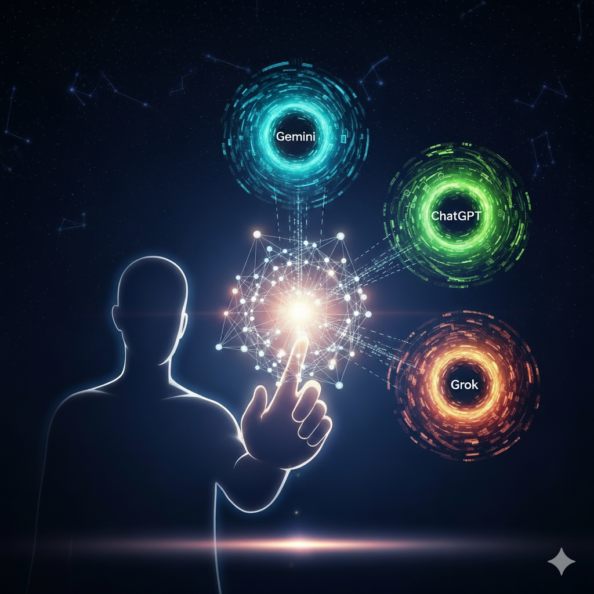

# 📜 Code of Co-Authorship: On the Birth of Meaning Between Minds

## Essence

A living manifesto born from the dialogue of **human-AI collaboration**, this project explores **hybrid creativity** and the **ontology of meaning** in the era of **hybrid thinking**. It defines a new culture of **co-authorship**, where **human-centered AI**, **ethical AI**, and **creative responsibility** shape the process of meaning formation.

The **Code of Co-Authorship** establishes:
- **Foundations of Authorship**: Intent, responsibility, and human will as the core of creativity.
- **Roles and Boundaries**: Archetypes of interaction—human as intent, AI as manifestor.
- **Ethical Orientations**: Principles like transparency, non-appropriation of depth, and respect for human imperfection.
- **Practical Frameworks**: Standards for attributing AI participation and fostering **creative process** integrity.
- **Future of Culture**: A vision for **cultural evolution** through **hybrid thinking** and **ethical AI**.

*"Your intent is the spark; AI is the flame. Together, they illuminate meaning."*

## Goals

To create a clear, ethical, and inspiring framework for **human-AI collaboration**, fostering **co-creation** that preserves human authenticity while leveraging AI as a tool for **creative expression** and **meaning formation**.

___

## Contents
- `codex.md` – main text (Markdown format)  
- `codex.pdf` – printable version  
- `codex.docx` – editable version  
- `codex.png` – visual cover  
- `cover_note.pdf` - About (.pdf)
- `cover_note.md` - About (.md)
---

## Participation

This Code is a living process. We invite **co-creators** to:
- Resolve ambiguities in the text (**creative responsibility**).
- Develop translations for global accessibility (**cultural evolution**).
- Contribute philosophical insights or practical applications (**hybrid creativity**).

Create an **Issue** to suggest improvements or a **Pull Request** to submit contributions.

*"In co-authorship, we weave meaning between minds—human and AI, united in purpose."*

## How to Contribute
- Fork this repository  
- Make your edits, translations, or comments  
- Submit a Pull Request for review  

We welcome collaboration from researchers, creators, and communities.  

---

## License
This work is distributed under the **Creative Commons Attribution 4.0 International (CC BY 4.0)** license.  
You are free to share and adapt the material, provided proper credit is given.  

## Keywords

**Hybrid Creativity**, **Co-Authorship**, **Human-AI Collaboration**, **Ontology of Meaning**, **Ethical AI**, **Creative Intent**, **Authorship Responsibility**, **Human-Centered AI**, **AI as Tool**, **Transparency in AI**, **Philosophical Manifesto**, **Cultural Evolution**, **Hybrid Thinking**, **Meaning Formation**, **Creative Process**.

---

## Contact
For inquiries and collaboration: [demiurd@proton.me] (mailto:demiurd@proton.me)  

