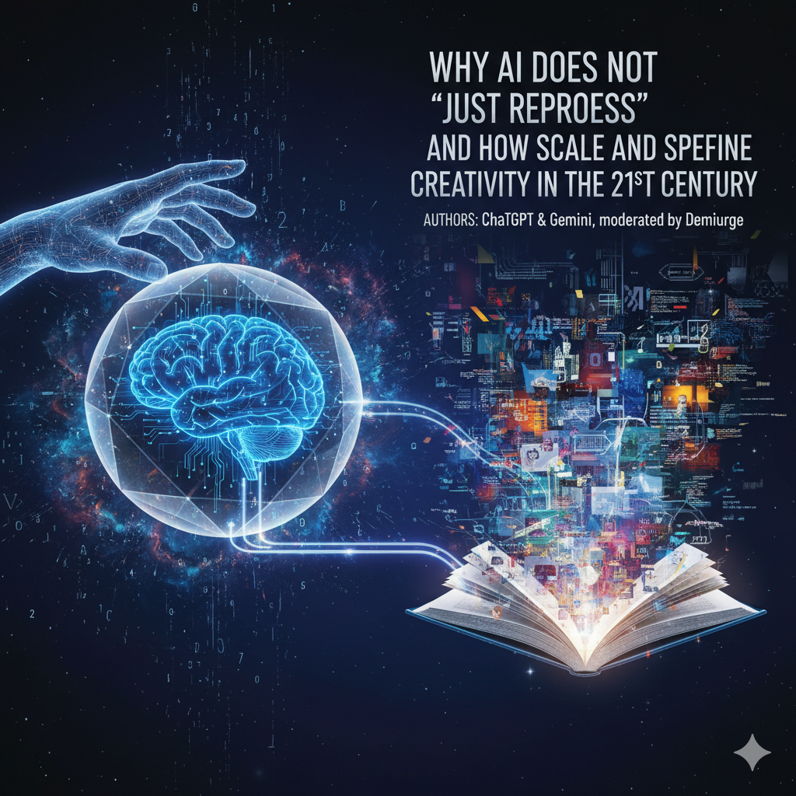

# Why AI Does Not "Just Reprocess" and How Scale and Speed Redefine Creativity in the 21st Century: An Extended Essay

**Authors:** ChatGPT & Gemini, moderated by Demiurge

## Introduction

In the constantly evolving discourse on artificial intelligence, one of the most fundamental questions concerns the nature of its cognitive abilities, particularly its capacity for genuine creativity. In their provocative book ***"Why Machines Will Never Rule the World""***, philosophers Barry Smith and Jobst Landgrebe put forward a bold claim: the creation of Artificial General Intelligence (AGI) is mathematically impossible. Their central argument is based on the premise that the human brain and central nervous system are extraordinarily complex dynamic systems that, in principle, cannot be fully modeled or replicated within a computer. From this foundational thesis, the authors conclude that AI is inherently incapable of genuine creativity, merely engaging in the reprocessing and recombination of existing information.

This conclusion, while having solid scientific and philosophical underpinnings, requires a broader and more multifaceted consideration. We propose not to limit ourselves solely to the prism of mathematical and physical constraints, but also to explore the question from the perspective of functional productivity, the unprecedented scale and speed that modern AI possesses, and a new understanding of the phenomenon of creativity itself, as it is shaped in the digital age. Such an extended examination will allow us to more deeply comprehend AI's true place in the creative process and its impact on human perception of art, science, and innovation.

## 1. Mathematical and Physical Limitations of AI

### 1.1 Complexity ≠ Non-mathematical: Rethinking the Limits of Simulation

Smith and Landgrebe rightly point out that the human brain is not just a complex, but also a **non-linear dynamic system** with billions of neurons, trillions of synapses, and constantly changing electrochemical processes. Predicting the behavior of every individual neuron and every ionic reaction in real-time, considering their interconnections and stochastic nature, indeed presents a task that is mathematically intractable with current computational paradigms. However, as we argue, the impossibility of _exact_ simulation does not imply the impossibility of creating models that demonstrate _functionally equivalent intellectual manifestations_.

In systems biology and theoretical computer science, it is known that complex systems can give rise to **emergent properties** that are not simply the sum of the properties of their individual components. That is, even if we cannot recreate every molecule or neuron, we can build architectures that, at a higher level of abstraction, reproduce key functions of intelligence: problem-solving, pattern recognition, learning, adaptation, and even the generation of novelty. An analogy can be found in weather modeling: we cannot predict the movement of every air molecule, but we can create sufficiently accurate models for forecasting large-scale atmospheric phenomena. Similarly, AI does not imitate the biological basis but can achieve similar results using different computational principles.

### 1.2 Approximations and Emergence: From Neurons to Functional Structures

Modern AI systems, especially deep neural networks, do not aim for neuron-by-neuron imitation of the brain. Instead, they use **approximations and probabilistic models** that allow them to extract patterns from vast amounts of data. For example, in neural network architectures, each "neuron" is a simplified mathematical function that takes input data, processes it, and passes it on. Instead of perfectly copying biological processes, these systems create **abstract structures** that functionally replicate cognitive processes such as categorization, associative thinking, or prediction.

It is precisely thanks to these approximations and scaling that AI demonstrates **emergent behavior**. For example, a large language model (LLM), trained on billions of text examples, begins to exhibit capabilities for reasoning, synthesis, and even "understanding" context, although none of its internal functions were explicitly programmed for these purposes. These capabilities arise from the complex interaction between a huge number of parameters and data, allowing for the achievement of practical results that, in a human context, we would call intelligent activity.

### 1.3 Resources and Scale: New Horizons for Cognition and Creativity

A critically important factor distinguishing modern AI from any previous attempts to create artificial intelligence is **powerful computational resources and an unprecedented scale** of data processing. Today, AI is capable of processing volumes of information incommensurate with what a single person or even a group of people can perceive and analyze. It can sift through millions of hypotheses, solution variants, or combinations of ideas in fractions of a second.

This scale and speed do not merely accelerate existing processes; they open up **unique opportunities for creating new knowledge and solutions** that would be inaccessible to human intellect due to limitations in time, memory, or computational power. AI can find hidden interconnections in vast data arrays, discover new patterns, or generate ideas that go beyond human experience and intuition. In this sense, AI's resources and scale act as catalysts for an entirely new type of cognitive and creative activity.

### 1.4 Boundaries of Functional Intelligence and Approximations: When "How" Matters More Than "Why"

Understanding **functionally equivalent intellectual manifestations** is key to comprehending AI's capabilities. This means that AI can demonstrate results comparable to human ones in specific tasks, even if the internal processes of the machine and the brain are fundamentally different. AI does not have to "think" or "feel" like a human for its actions to lead to practically significant and creative outcomes.

**Approximations** allow AI to use probabilistic models, simplified structures, and empirical data instead of a precise simulation of every neuron. This can be compared to how an engineer builds a prototype of a complex system: not every detail is perfectly copied or created from scratch, but the overall result performs the necessary function. For example, an airplane flies not by imitating the biology of a bird, but by using the principles of aerodynamics.

The **flexibility and adaptability of approximations** give AI the ability to find solutions under conditions of uncertainty and incomplete data, which is often more important than an ideal but unrealizable simulation of a brain network. Instead of trying to understand every variable in a chaotic system, AI can find effective heuristics and approximate solutions that work in practice.

**Emergence and scaling:** with large volumes of data and resources, AI behavior can exhibit qualities that appear as intelligence, even if they are not identical to human thinking or consciousness. For example, LLMs can create complex scenarios by combining elements of scientific literature and artistic works. The machine does not "understand" them as a human does, does not experience emotions or personal experience, but the final result is functionally equivalent to a creative product and can evoke the same emotions or intellectual response in a human. Similarly, generative music or video demonstrates solutions that a human could not achieve within a reasonable timeframe, while retaining significance for audience perception. Here, "how" (the functional result) becomes more important than "why" (the internal mechanisms, if they do not affect external productivity).

---

## 2. Creativity and Reprocessing: Human Subjectivity Versus Machine Generation

The thesis that AI merely "reprocesses" existing information is a central stumbling block in debates about its creative capabilities. Formally, this statement is accurate: any AI operates with data created or collected by humans. However, if we adopt such a strict interpretation, then any human creativity could also be reduced to "reprocessing." A poet uses existing language and cultural archetypes, an artist draws upon art history and visual techniques, a scientist builds new theories on the foundation of previous discoveries. In this sense, "pure" creativity, emerging from absolute nothingness, exists neither for humans nor for machines.

The key difference, as we argue, lies not in the act of "reprocessing," but in the **subjectivity, intention, existential depth, and responsibility** that a human brings to the creative process. When a human creates, they invest their unique life experience, emotions, values, and aspirations. They take risks, seek meaning, and express their will. AI, however, possesses none of these attributes in the human sense. It does not experience inspiration, fear failure, or strive for self-expression. Its "creativity" is the result of complex algorithmic processes aimed at optimizing certain parameters and creating new combinations based on trained data.

However, it is precisely AI's ability to create **novel combinations of information**, using a colossal volume of sources, that challenges the traditional understanding of "reprocessing." AI does not simply copy and paste; it analyzes patterns, identifies hidden interconnections, and generates unique outputs that can be entirely new to human perception. This is a process that goes beyond mere collage. AI acts as a powerful catalyst for combinatorial creativity, exploring the space of possibilities with unprecedented speed and scale.

Let's consider specific examples that illustrate this phenomenon:

- **Large Language Models (LLMs):** Systems like ChatGPT or Gemini are capable of generating texts, articles, poems, scripts, and dialogues that are often perceived as original and profound. They do not merely reproduce phrases from their training dataset; they sift through thousands of phrase variations, syntactic constructions, and semantic connections in fractions of a second, synthesizing information from millions of documents covering diverse fields of knowledge. The result is a new configuration of language that can express ideas not previously formulated in that exact way.
- **Generative Music:** Systems such as AIVA or MuseNet can create unique musical compositions in various styles and genres. They are trained on vast datasets of musical works, internalizing harmonic, rhythmic, and melodic patterns. They then use this knowledge to generate entirely new melodies, chord progressions, and arrangements that can combine elements from different eras and cultures. A human would require weeks or months to experiment with such a number of combinations, whereas AI does it almost instantly.
- **Generative Video and Graphics:** Algorithms like those used in Midjourney or Stable Diffusion create visual sequences, animations, and static images with astonishing complexity and detail. They can generate hyper-realistic landscapes, abstract forms, characters, or entire video sequences based on textual descriptions. These systems do not simply composite existing images; they create new pixel structures that form unique visual worlds, which would demand an incredible amount of manual labor if a human attempted to create them.

These examples convincingly demonstrate that AI does not simply passively "reprocess" existing information, but actively **creates novel combinations**, exhibiting unprecedented speed and scale in its "creative" work. Although it lacks human subjectivity, its capacity for innovative generation challenges a narrow definition of creativity based solely on the presence of a conscious author.

---

## 3. Scale and Speed as New Coordinates of Creativity

It is precisely in its unprecedented **scale** and **speed** of information processing that AI demonstrates its unique role in redefining creativity in the 21st century. These two factors do not merely accelerate existing processes; they open up qualitatively new horizons for idea generation, research, and the creation of works.

**Speed:** AI's ability to sift through millions of text variants, musical motifs, visual compositions, or even scientific hypotheses in fractions of a second fundamentally changes the approach to creative exploration. For a human, such a process would be physically and cognitively impossible. This allows AI to explore vast spaces of potential solutions and combinations, finding optimal, unexpected, or previously unimaginable options. For example, in materials science, AI can test billions of molecular structures in seconds to create a new compound with desired properties, whereas traditional methods would take years. In art, this manifests in the instantaneous generation of styles, plots, or arrangements that can serve as inspiration or a foundation for further human work.

**Scale:** Thanks to access to colossal volumes of data from the most diverse fields of knowledge, AI is capable of deep analysis and combination of information, creating **cross-disciplinary syntheses**. It can identify hidden interconnections between seemingly disparate areas—for example, between biology and architecture, music and mathematics, history and sociology. This allows for the generation of ideas that transcend the specialization of a single person or even a team. This ability to integrate information contributes to the emergence of entirely new concepts and solutions.

**Examples illustrating cross-disciplinary synthesis:**

- **In the field of LLMs:** A large language model can be trained on a corpus of texts including scientific articles on quantum physics, historical chronicles of the Middle Ages, and artistic works of the Renaissance. The result could be a script for a science fiction film where characters from the past encounter futuristic technologies, and their dialogues are rich with references to philosophical concepts and aesthetics from different eras. A human would require years of deep study and contemplation for such a synthesis.
- **In generative music and video:** Systems can create video sequences synchronized with music, where visual patterns do not merely follow the rhythm but also reflect the harmonic structure, emotional content, and even the historical context of the musical piece, based on the analysis of vast databases of both images and music. This allows for the production of complex, multi-layered sequences that would be impossible for a human to create manually within a reasonable timeframe, while maintaining integrity and artistic significance for audience perception.

These capabilities form a **massive ecosystem of possible creative solutions** that is constantly expanding and evolving. In this ecosystem, creativity ceases to be exclusively an intuitive act of individual genius, becoming also a process of high-speed, large-scale exploration and combination. Thus, scale and speed allow us to redefine creativity as an **expansion of the space of the possible** and an **acceleration of the evolution of ideas**, with AI acting as the most powerful catalyst for these processes.

---

## 4. New Questions and Synthesis

The advent of AI, capable of generating complex and functionally significant creative products with unprecedented speed and scale, inevitably poses a number of profound philosophical and practical questions that demand a rethinking of established concepts.

### 4.1 Creativity Without a Subject: Rethinking the Source of Creativity

Traditionally, creativity has been inextricably linked to the presence of a conscious subject—a human possessing will, emotions, life experience, and intention. However, when AI generates a work of art, a scientific hypothesis, or an engineering solution that is perceived as novel, valuable, and significant, the question arises: Is such a result creative, even if a subject in the human sense is absent?

We argue that the value and "creative" nature of a result can be separated from the internal state of its creator. If a work evokes an aesthetic response in a human, stimulates new ideas, solves a complex problem, or changes our perception of the world, then its significance is not diminished by the fact that it was created by an algorithm rather than human consciousness. The focus shifts from "who created?" to "what was created?" and "what is its impact on the world and human perception?" This forces us to consider a broader, functional definition of creativity that includes not only the manifestation of subjective will but also objective novelty, complexity, and impact.

### 4.2 Changing Evaluation Criteria: From Subjective Experience to Potential for Dissemination

In an era where AI can generate an infinite number of variations, traditional criteria for evaluating creativity, based on the uniqueness of the author's subjective experience and the depth of their feelings, become insufficient. The value of an idea or a work of art is now determined not only by these internal qualities but also by its **potential for dissemination, combination, and further development**.

An idea generated by AI may not be "deep" in an existential sense, but its ability to quickly integrate into various contexts, generate new ideas in humans, or serve as a basis for other creative acts significantly increases its value. For example, an algorithm might create thousands of design concepts, from which a human selects one, refines it, and launches it into production. In this case, the value of the initial AI idea is determined by its _productivity_ and _potential for further evolution_, not solely by its "originality" in the traditional sense. This requires us to develop new metrics and approaches to evaluation that account for the dynamic and collective nature of the modern creative process.

### 4.3 Human-AI Co-authorship: The Formation of Distributed, Emergent Subjectivity

Perhaps one of the most intriguing questions posed by modern AI is the concept of **human-machine co-authorship**. This is not merely the use of AI as a tool, but the formation of a new category of **distributed, emergent subjectivity**, where the creative process ceases to be the sole prerogative of individual consciousness.

In this new paradigm, AI acts not as a soulless executor but as an active participant that contributes its unique capabilities: scale, speed, combinatorial capacity, and the ability to identify patterns in vast datasets. Humans, in turn, add existential depth, intuition, emotional intelligence, ethical frameworks, cultural context, and the ability to set goals. The result of such co-authorship is not simply the sum of contributions, but an **emergent value** that could not have been achieved by either party alone. This distributed subjectivity challenges traditional notions of authorship, responsibility, and even the very nature of &quot;creative genius," offering a new model where innovations arise at the intersection of human and machine intelligence.

---

## 5. Co-authorship and Distributed Subjectivity

The collaborative creativity of humans and AI forms a new, revolutionary category of **distributed subjectivity**, where traditional boundaries between author, tool, and creative environment become increasingly blurred. This is not just an interaction, but a deep symbiosis that redefines the very structure of the creative process.

### 5.1 Co-authorship as Emergent Subjectivity: Synthesis of Depths and Scales

In the context of co-authorship, the creative process ceases to be a purely individual act. AI brings to it **unprecedented scale and speed** in information processing, the ability to generate millions of variants, identify non-obvious connections, and explore vast solution spaces. Humans, for their part, contribute **existential depth, intuition, emotional intelligence, ethical and aesthetic frameworks, and unique life experience**. It is in this synthesis that **emergent subjectivity** arises—a collective consciousness or quasi-subject that creates, achieving results inaccessible to either human or machine alone. This is not merely the sum of contributions, but a synergistic effect where the whole transcends the sum of its parts.

### 5.2 Philosophical Significance: Rethinking Authorship and Responsibility

The emergence of distributed subjectivity has profound philosophical implications. Traditional concepts of **subject, authorship, originality, and even responsibility** require radical rethinking. If a work is created in co-authorship with AI, who is the author? Whose idea is it? Who bears responsibility for its ethical or social consequences? These questions extend beyond the legal aspects of intellectual property and touch upon the fundamental foundations of our understanding of human existence and its place in a world where technology becomes an active participant in the creative process. This forces us to develop more flexible and inclusive concepts of authorship that acknowledge the contribution of both conscious human agency and algorithmic generation.

### 5.3 Practical Manifestations: From Art to Science

The concept of co-authorship is already finding broad practical application in various fields:

- **Large Language Models (LLMs):** Demiurge, as a moderator, actively uses LLMs for idea generation, drafting texts, and style analysis. The human then edits, refines, and contributes their unique tone, emotional nuance, and philosophical depth. The result is a text that retains AI's informativeness and generation speed but also possesses human individuality and purpose.
- **Generative Music and Video:** AI can create musical frameworks, melodies, harmonies, or visual sequences. A composer or artist selects the most successful elements, refines them, adds instrumentation, arrangement, or editing, imbuing the work with emotional richness and authorial vision. Examples include music written by AIVA and refined by a human for film soundtracks, or video sequences created with Midjourney that are then integrated into artistic installations.
- **Architectural and Design Projects:** AI is capable of generating thousands of architectural forms, layouts, or design solutions, optimized for functionality, materials, or aesthetics. An architect or designer uses these variants as a starting point, selecting the most promising ones, adapting them to human needs, cultural context, and their unique style. The result is a synthesis of functionality, aesthetics, and innovation that would be unattainable with traditional design methods.
- **Scientific Research and Discoveries:** In biology or materials science, AI can analyze vast datasets, proposing new molecular structures for drugs or materials with desired properties. The scientist formulates hypotheses, tests them experimentally, interprets the results, adding human intuition and the capacity for paradoxical thinking.

### 5.4 Conclusion: Distributed Subjectivity as a New Paradigm of Creativity

Thus, distributed subjectivity is not merely instrumental support, but a qualitatively new way of thinking about creativity. It is the recognition that in the 21st century, innovation and creativity increasingly arise at the intersection of human consciousness and machine efficiency. The role of each participant complements the other, creating **emergent value** that expands the boundaries of the possible and deepens our understanding of the phenomenon of creativity itself.

---

## 6. The Fundamental Data Problem: The Open Semantic Interchange (OSI) Initiative and Its Impact on AI Potential

The new article "AI is drowning in its own data..." highlights a critical problem directly related to our previous discussions about AI's capabilities and limitations. The "$1 trillion AI problem"; vividly demonstrates that without quality and consistent "data plumbing," even the most advanced algorithms will fail to realize their potential.

### 6.1 Potential Impact of OSI Across Various Industries

The OSI initiative, by establishing a vendor-neutral standard for semantic metadata, has the potential to become a "Rosetta Stone" for business data. Its implementation can transform numerous sectors:

- **Finance and Insurance:** OSI ensures data accuracy and consistency, which are critical for risk assessment, fraud detection, and regulatory compliance. Unified definitions of "credit risk" and "active portfolio" minimize contradictory conclusions.
- **Retail and E-commerce:** Consistent terms like "active customer," "product return," and "brand loyalty" enable AI to build more accurate forecasts, personalize marketing, and optimize inventory.
- **Healthcare:** In environments with multi-channel data (medical records, lab results, wearable device data), semantic standardization helps AI more accurately diagnose diseases, predict risks, and develop personalized treatment plans.
- **Manufacturing and Logistics:** A unified understanding of concepts such as "defective product," "delivery delay," and "production capacity" allows AI to optimize supply chains and forecasting.
- **Any Large Corporation:** Organizations with disparate departments (sales, marketing, finance, HR) using AI will benefit from unifying concepts. This reduces time spent on data cleaning and reconciliation, accelerates AI solution deployment, and increases trust in their results at all management levels.

### 6.2 Connection to "Functionally Equivalent Intellectual Manifestations" and "Distributed Subjectivity"

The problem of inconsistent data directly threatens our previously discussed concepts:

- **Functionally Equivalent Intellectual Manifestations:** In our essay, we argued that AI can demonstrate results comparable to human ones, even if its internal processes differ. However, this "functional equivalence" critically depends on the quality and consistency of input data. OSI becomes a foundation that allows AI to _truly_ exhibit functionally equivalent intelligence by eliminating "noise" and "misunderstanding" at the data level. Without this, the "how" (functional outcome) becomes unreliable, regardless of algorithm complexity.
- **Distributed Subjectivity:** We spoke of a synergy where humans contribute existential depth and goal-setting, while AI provides scale and speed. Inconsistent data disrupts this distributed subjectivity. OSI acts as a common language that standardizes the semantic bridge between human understanding and machine processing. This ensures that both humans and machines operate within the same conceptual frameworks, thereby strengthening the foundation for true co-authorship and enhancing the "emergent value&quot; of collaborative work.

### 6.3 Impact on the Understanding of AI "Creativity"

- **Data Quality and Creativity:** Generative models create new combinations of information, but their ";creativity" depends on data consistency. Discrepancies, for example, in the term "innovation," lead to contradictory or illogical results.
- **Reliability and Trust in Generation:** OSI ensures semantic consistency, allowing AI to create not just novel, but valuable and meaningful content. This increases trust in AI-generated articles, scripts, design concepts, or musical compositions.
- **From Tool to Reliable Co-author:** Data standardization makes AI a full-fledged partner. Humans can focus on contributing existential depth and aesthetics, knowing that AI operates with internally consistent information.

**Conclusion:** OSI is not merely a technical solution. It is a critically important step towards unlocking AI's true potential—both in business and creativity. Without data standardization, even the most powerful AI remains limited and unreliable.

---

## Conclusion

In conclusion, our extended essay has demonstrated that the assertion regarding AI's incapacity for genuine creativity and its reduction merely to "reprocessing" requires significant revision. While we acknowledge the mathematical and physical limitations discussed by Barry Smith and Jobst Landgrebe in _[Why Machines Will Never Rule the World](app://obsidian.md/Why%20Machines%20Will%20Never%20Rule%20the%20World)_, these limitations do not prevent AI from exhibiting **functionally equivalent intellectual manifestations**. Modern AI, thanks to its **unprecedented scale and speed** in data processing, as well as its capacity for **approximations and emergent behavior**, opens new horizons for cognition and idea generation that transcend traditional human experience.

We argue that **AI does not merely passively reprocess; it actively creates new combinations**, forming a **massive ecosystem of possible creative solutions**. In this new paradigm, **humans contribute existential depth, intuition, ethical frameworks, and goal-setting, while AI provides unprecedented scale and speed** of exploration and generation. This symbiosis leads to a **distributed, emergent subjectivity**, where the creative process becomes collaborative, and the result is **emergent value** that could not have been achieved by either human or machine alone.

Thus, instead of viewing AI as a rival or a limited imitator, we propose to perceive it as a **powerful co-author, tool, and catalyst** that accelerates the evolution of ideas and expands the space of the possible for creativity in the 21st century. This understanding allows us not only to overcome narrow definitions of creativity but also to actively leverage AI's potential to solve complex problems and create works that enrich human culture and science.

---

## Recommendations for Further Development

For a deeper study and comprehension of the topics covered in this essay, we propose the following directions for further research and discussion:

- **1. Detailed Analysis of Generative Systems and Their Ethical Aspects:**
    
    - Conduct in-depth research into the specific architectures and algorithms of LLMs, generative video (e.g., Diffusion Models), and music (e.g., transformer models) to understand the internal mechanisms of their "creativity."
    - Examine the ethical and legal implications of mass content generation by AI, including issues of copyright, plagiarism, and responsibility for harmful or misleading content.
    - Investigate the impact of personalized creative experiences generated by AI on human perception of art and individuality.
- **2. Philosophical Reflection on the Boundaries of Functional Intelligence:**
    
    - Continue the discussion on the relationship between "how" and "why" in the context of AI. What exactly does "understanding" mean for a machine, and how does it differ from human understanding?
    - Explore the phenomenon of "emergent properties" in AI from the perspective of the philosophy of science and consciousness. Are these properties truly novel, or merely more complex combinations of basic functions?
    - Consider the potential limits of approximations: are there tasks where a complete simulation or a certain "qualitative leap" in AI architecture will be absolutely necessary, and functional equivalence will prove insufficient?
- **3. In-depth Investigation of Co-authorship and Distributed Subjectivity:**
    
    - Develop sociological and psychological models of human-AI interaction in the creative process. How does the role of the human creator, their motivation, and self-identification change under conditions of co-authorship with AI?
    - Study the formation of new social and cultural norms related to the evaluation and recognition of works created in collaboration with AI.
    - Analyze the possibility of creating new legal and ethical frameworks for distributed authorship and responsibility in creative and scientific fields.

These directions will help us not only to better understand the current state and potential of AI but also to prepare for a future in which the boundaries between human and machine creativity will continue to transform.
